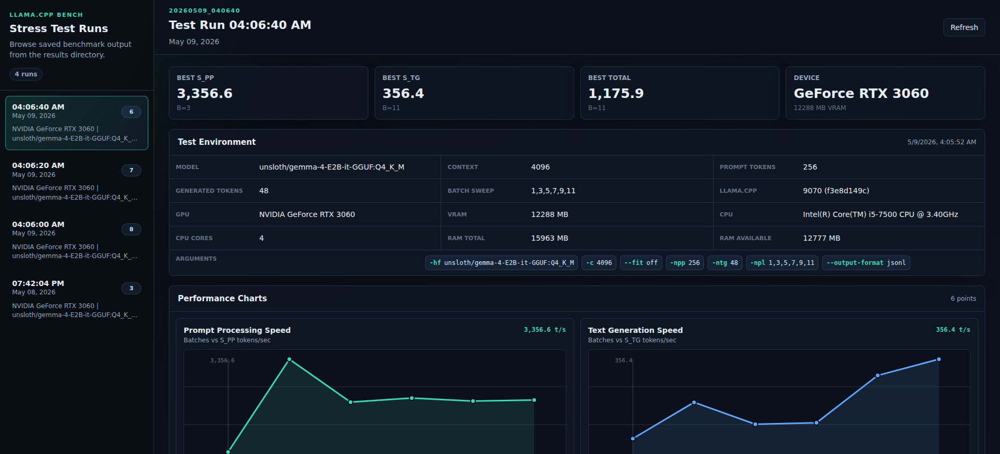

# llama.cpp Stress Test Helper

A small Docker-based wrapper for `llama-batched-bench`. It runs the official llama.cpp container, saves JSONL benchmark output, and serves past runs through a simple results viewer.



## Quick Start

```bash
docker compose up test
```

Results are written to `results/YYYYMMDD_HHMMSS/`.

To view past runs:

```bash
docker compose up server
# Open http://localhost:8000/results.html
```

## Default Benchmark

The included `compose.yaml` uses:

- Image: `ghcr.io/ggml-org/llama.cpp:full-cuda-b9070`
- Model: `unsloth/gemma-4-E2B-it-GGUF:Q4_K_M`
- Benchmark: `llama-batched-bench`
- Output: forced to `jsonl`
- Cache: `./model-cache` mounted to `/root/.cache`

Current benchmark arguments:

```bash
-hf unsloth/gemma-4-E2B-it-GGUF:Q4_K_M \
-c 4096 --fit off \
-npp 256 -ntg 128 -npl 1,2,3
```

The example keeps `-b` and `-ub` at llama.cpp defaults so the compose file stays a simple baseline.

## Docker Run Equivalent

```bash
docker run --rm --gpus all \
  -v "$(pwd)/model-cache:/root/.cache" \
  -v "$(pwd)/results:/app/results" \
  -v "$(pwd)/bench-helper.sh:/app/bench-helper.sh" \
  --entrypoint /app/bench-helper.sh \
  ghcr.io/ggml-org/llama.cpp:full-cuda-b9070 \
  -hf unsloth/gemma-4-E2B-it-GGUF:Q4_K_M \
  -c 4096 --fit off \
  -npp 256 -ntg 128 -npl 1,2,3
```

To use a local model, replace `-hf ...` with `-m /app/models/your-model.gguf` and mount your models directory.

## Output

Each run creates:

- `output.jsonl`: benchmark rows
- `environment.json`: timestamp, llama.cpp version, arguments, GPU, CPU, and RAM metadata

The viewer lives at `results/results.html` and browses all timestamped result directories.

## Batch Tuning

Use [`tune-batch.sh`](/home/phate/llamacpp-stress-test/tune-batch.sh) to sweep `-b` and `-ub` values:

```bash
./tune-batch.sh
```

Custom sweep:

```bash
./tune-batch.sh -b 1024,2048,4096 -u 256,512,1024
```

`-b` and `-ub` are hardware- and workload-sensitive, so validate the best candidates against your real server workload before treating them as final.

## Requirements

- Docker
- [NVIDIA Container Toolkit](https://docs.nvidia.com/datacenter/cloud-native/container-toolkit/latest/install-guide.html)

## Setup

```bash
git clone https://github.com/Phate334/llamacpp-stress-test.git
cd llamacpp-stress-test
chmod +x bench-helper.sh tune-batch.sh
```

## Acknowledgments

- Built around [llama.cpp](https://github.com/ggml-org/llama.cpp) `batched-bench`
- Uses [charts.css](https://github.com/ChartsCSS/charts.css) for charts
