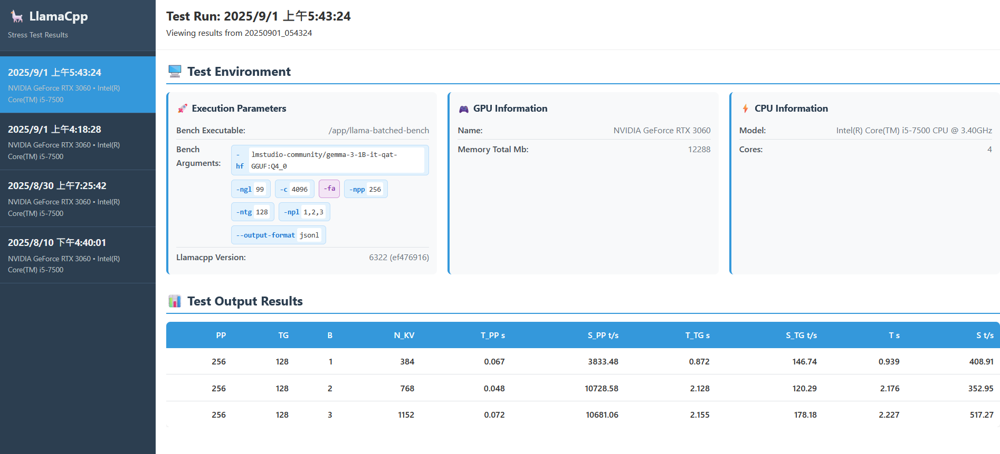

# llama.cpp 壓力測試輔助工具

此專案提供一個 bash 腳本，作為 llama.cpp 的 `llama-batched-bench` 包裝器，僅透過 Docker 容器使用：將 `bench-helper.sh` 掛載到官方 llama.cpp 映像並執行以取得結果。



### 使用 Docker Compose（建議）

如有需要可編輯 `compose.yaml`，然後執行（服務名稱：`test`）：

```bash
docker compose up test
```

結果會保存在 `results/YYYYMMDD_HHMMSS/`。

若要用簡單的 HTTP 伺服器瀏覽歷史結果：

```bash
docker compose up server
# 開啟 http://localhost:8000
```

`compose.yaml` 重點：

- 映像：`ghcr.io/ggml-org/llama.cpp:full-cuda-b6322`
- 透過 `-hf lmstudio-community/gemma-3-1B-it-qat-GGUF:Q4_0` 直接下載 Hugging Face 模型，而非預先掛載的本地檔案
- 下載的模型快取掛載到主機目錄 `model-cache`，容器內路徑 `/root/.cache/llama.cpp`
- 範例平行 prompt 設定：`-npl 1,2,3`

### 一行指令執行 Docker（等同 compose.yaml 的 `test` 服務）

```bash
docker run --rm --gpus all \
  -v "$(pwd)/model-cache:/root/.cache/llama.cpp" \
  -v "$(pwd)/results:/app/results" \
  -v "$(pwd)/bench-helper.sh:/app/bench-helper.sh" \
  --entrypoint /app/bench-helper.sh \
  ghcr.io/ggml-org/llama.cpp:full-cuda-b6322 \
  -hf lmstudio-community/gemma-3-1B-it-qat-GGUF:Q4_0 \
  -ngl 99 -c 4096 -fa \
  -npp 256 -ntg 128 -npl 1,2,3
```

若改用本地模型，將 `-hf ...` 改成：

```bash
-m /app/models/你的模型.gguf
```

並新增掛載：`-v "$(pwd)/models:/app/models"`。

### 腳本行為與選項

- 強制加上 `--output-format jsonl`。若使用者提供該選項會被忽略並提示警告。
- `-o, --output-dir DIR`：自訂輸出目錄；否則建立 `results/YYYYMMDD_HHMMSS/`。
- `-h, --help`：轉呼叫容器內 `/app/llama-batched-bench -h`。
- 執行前會保存環境資訊（nvidia-smi、CPU、RAM）。

## 輸出檔案

腳本會在 `results/` 目錄下的時間戳記目錄中生成以下檔案：

每次執行都會建立一個新的目錄，格式為 `results/YYYYMMDD_HHMMSS/`，包含：

1. **基準測試結果** (`output.jsonl`)：包含逐行的測試結果。
2. **環境元數據** (`environment.json`)：包括系統資訊和測試參數。
3. **結果檢視器** (`index.html`)：用於檢視和分析結果的 HTML 介面。

這樣可以讓您依執行時間整理多次測試執行的結果。

## 需求

- Docker
- [NVIDIA Container Toolkit](https://docs.nvidia.com/datacenter/cloud-native/container-toolkit/latest/install-guide.html)

## 快速安裝

```bash
git clone https://github.com/Phate334/llamacpp-stress-test.git
cd llamacpp-stress-test

# 使腳本可執行（若需本機執行）
chmod +x bench-helper.sh
```

## 致謝

作為 [llama.cpp](https://github.com/ggml-org/llama.cpp) `batched-bench` 工具的包裝器構建。
