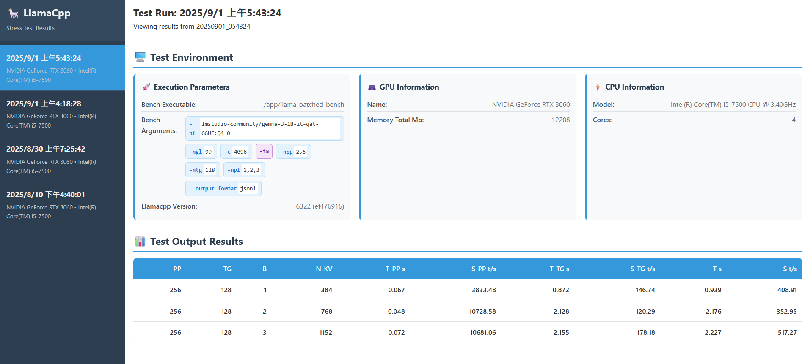

# llama.cpp 壓力測試輔助工具

此專案提供一個 bash 腳本，作為 llama.cpp 的 `llama-batched-bench` 包裝器，僅透過 Docker 容器使用：將 `bench-helper.sh` 掛載到官方 llama.cpp 映像並執行以取得結果。



### 使用 Docker Compose（建議）

如有需要可編輯 `compose.yaml`，然後執行（服務名稱：`test`）：

```bash
docker compose up test
```

結果會保存在 `results/YYYYMMDD_HHMMSS/`。

若要用簡單的 HTTP 伺服器瀏覽歷史結果：

```bash
docker compose up server
# 開啟 http://localhost:8000/results.html
```

`compose.yaml` 重點：

- 映像：`ghcr.io/ggml-org/llama.cpp:full-cuda-b8576`
- 透過 `-hf lmstudio-community/gemma-3-1B-it-qat-GGUF:Q4_0` 直接下載 Hugging Face 模型，而非預先掛載的本地檔案
- 下載快取掛載到主機目錄 `model-cache`，容器內路徑 `/root/.cache`，因此 Hugging Face 模型檔與 llama.cpp 的 preset/cache 都能保留
- 範例明確固定 `--fit off`，避免新版 llama.cpp 自動調整參數影響 benchmark 可重現性
- 範例平行 prompt 設定：`-npl 1,2,3`
- 範例刻意不預先指定 `-b` / `-ub`，先保留 llama.cpp 預設值作為基準，再依硬體個別調整

### 一行指令執行 Docker（等同 compose.yaml 的 `test` 服務）

```bash
docker run --rm --gpus all \
  -v "$(pwd)/model-cache:/root/.cache" \
  -v "$(pwd)/results:/app/results" \
  -v "$(pwd)/bench-helper.sh:/app/bench-helper.sh" \
  --entrypoint /app/bench-helper.sh \
  ghcr.io/ggml-org/llama.cpp:full-cuda-b8576 \
  -hf lmstudio-community/gemma-3-1B-it-qat-GGUF:Q4_0 \
  -ngl 99 -c 4096 -fa on --fit off \
  -npp 256 -ntg 128 -npl 1,2,3
```

若改用本地模型，將 `-hf ...` 改成：

```bash
-m /app/models/你的模型.gguf
```

並新增掛載：`-v "$(pwd)/models:/app/models"`。

若使用 `-hf`，llama.cpp 目前會把 GGUF 模型內容存到 `/root/.cache/huggingface/...`，也可能把 preset 快取寫到 `/root/.cache/llama.cpp/...`。因此把主機的 `model-cache` 掛載到 `/root/.cache` 才能完整保留兩者。

### 腳本行為與選項

- 強制加上 `--output-format jsonl`。若使用者提供該選項會被忽略並提示警告。
- `-o, --output-dir DIR`：自訂輸出目錄；否則建立 `results/YYYYMMDD_HHMMSS/`。
- `-h, --help`：轉呼叫容器內 `/app/llama-batched-bench -h`。
- 執行前會保存環境資訊（nvidia-smi、CPU、RAM）。
- 範例使用 `-fa on`，因為新版 llama.cpp 的 `--flash-attn` 已改成明確的 `on|off|auto` 參數。
- 範例同時指定 `--fit off`，避免 benchmark 被新版預設的 auto-fit 默默調整。

## 為什麼要調 `-b` 和 `-ub`

在目前的 llama.cpp 版本中，這兩個參數控制的是不同層次的 batch：

- `-b, --batch-size`：logical maximum batch size，也就是較大的排程上限。
- `-ub, --ubatch-size`：physical maximum batch size，也就是後端實際一次處理的 micro-batch 大小。

需要調整它們的原因：

- 較大的 `-b` 常常有助於提升 prompt processing throughput，也就是 `PP`。
- 較大的 `-ub` 有機會提升 GPU 利用率，但也會增加 compute buffer 壓力，可能拖慢 `TG`，或讓更多資源卡在 VRAM 邊界。
- 最佳組合會依模型、顯卡、context 長度與 workload 而變。長 prompt 最佳值，通常不等於長生成最佳值。

這個 repo 的預設範例沒有直接寫死 `-b` / `-ub`，原因是：

- `compose.yaml` 主要提供可重現的 baseline。
- `-b` / `-ub` 是很吃硬體與 workload 的調參旋鈕，文件裡直接寫單一「最佳值」通常會誤導。
- 真正調參時建議搭配 `--fit off`，避免 llama.cpp 為了 fit 記憶體而偷偷改動其他條件，讓比較失真。

實務上可以這樣理解：

- 先從 llama.cpp 預設值開始。
- 先掃 `-ub`，看 prompt throughput 是否提升且 generation 沒有明顯退步。
- 再掃 `-b`，檢查 prompt-heavy workload 是否繼續受益。
- 最後把前 1-2 組候選值拿去真正的 `llama-server` workload 驗證，不要只看 `llama-bench`。

## `-b` / `-ub` 調參腳本

此 repo 另附 [`tune-batch.sh`](/home/phate/llamacpp-stress-test/tune-batch.sh)，可以用 `docker compose run --rm` 自動掃描多組 `-b x -ub`，再整理出建議組合。

預設行為：

- 使用 `compose.yaml` 的 `test` 服務
- 直接執行 `/app/llama-bench`
- 一次測多組 `-b` 與 `-ub`
- 輸出 `raw.csv`、`summary.tsv`、`recommendations.txt`
- 提供三種建議：平衡型、PP 優先、TG 優先

基本用法：

```bash
./tune-batch.sh
```

自訂 sweep 範圍：

```bash
./tune-batch.sh -b 1024,2048,4096 -u 256,512,1024
```

若要改 benchmark 參數，請放在 `--` 後：

```bash
./tune-batch.sh -b 1024,2048,4096 -u 256,512,1024 -- \
  -hf lmstudio-community/gemma-3-1B-it-qat-GGUF:Q4_0 \
  -ngl 99 -fa 1 -ctk f16 -ctv f16 -p 512 -n 128
```

這個腳本是以一般 causal generation 模型為前提設計；若之後改用 embeddings 或其他 non-causal 模型，不能直接假設 `-b > -ub` 一定可行。

## 輸出檔案

每次 benchmark 執行都會在 `results/` 下建立一個 `results/YYYYMMDD_HHMMSS/` 目錄。

wrapper 腳本會寫入：

1. **基準測試結果** (`output.jsonl`)：包含逐行的測試結果。
2. **環境元數據** (`environment.json`)：包括系統資訊和測試參數。

結果檢視器是 repo 內建的 `results/results.html`，不是每次執行時額外產生的 `index.html`。啟動 `docker compose up server` 後，請開啟 `http://localhost:8000/results.html` 來瀏覽所有歷史結果。

## 需求

- Docker
- [NVIDIA Container Toolkit](https://docs.nvidia.com/datacenter/cloud-native/container-toolkit/latest/install-guide.html)

## 快速安裝

```bash
git clone https://github.com/Phate334/llamacpp-stress-test.git
cd llamacpp-stress-test

# 使腳本可執行（若需本機執行）
chmod +x bench-helper.sh
chmod +x tune-batch.sh
```

## 致謝

- 作為 [llama.cpp](https://github.com/ggml-org/llama.cpp) `batched-bench` 工具的包裝器構建。
- 使用 [charts.css](https://github.com/ChartsCSS/charts.css) 展示圖表。
